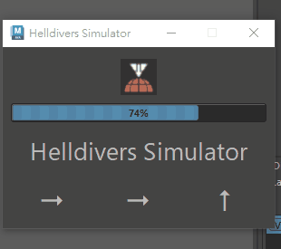

# Helldivers in maya





```

import sys
path = r"D:\file\Code\MayaCode\temp"
sys.path.append(path)
exec(open(path + r"\helldiver_in_maya.py", encoding="utf8").read())

```

Enter the following code in the Python Script Editor of Maya 2022 or higher versions.
Please modify the 'path' variable to your own unzipped and saved file path.

You are free to add images and commands. Please note that the list length of image_list and self.
fixed_direction_sequences must be the same, and their order must also correspond.
